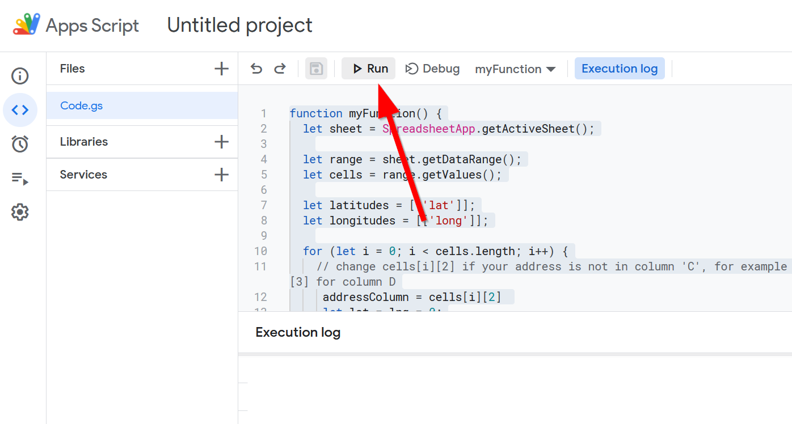
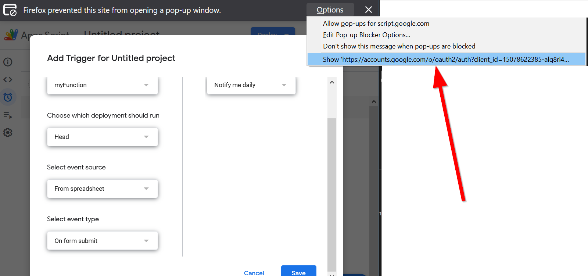
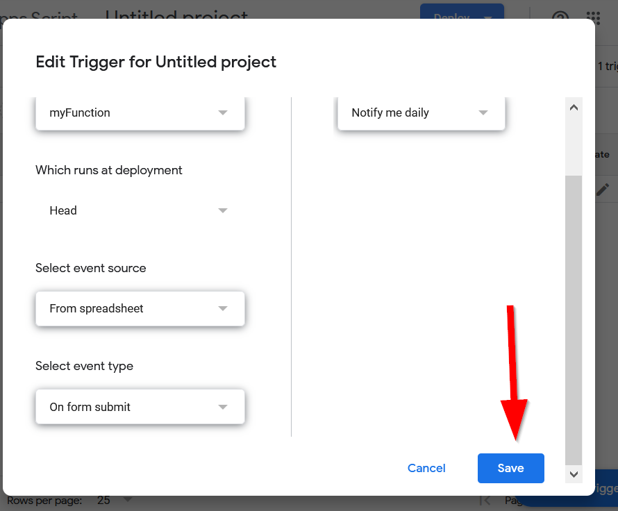
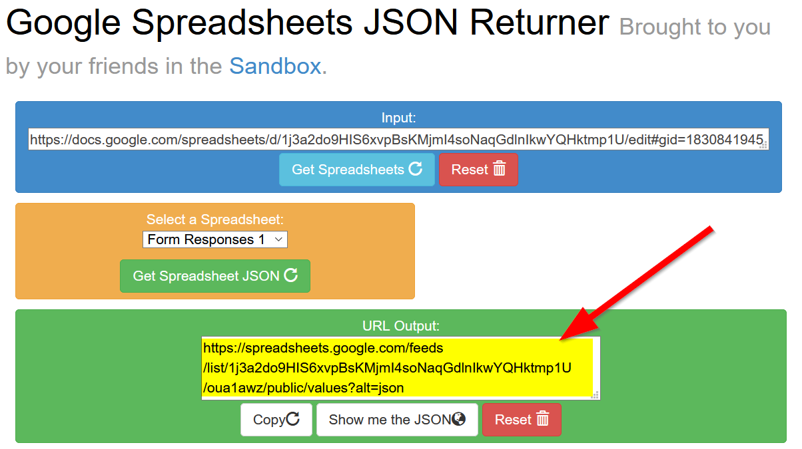
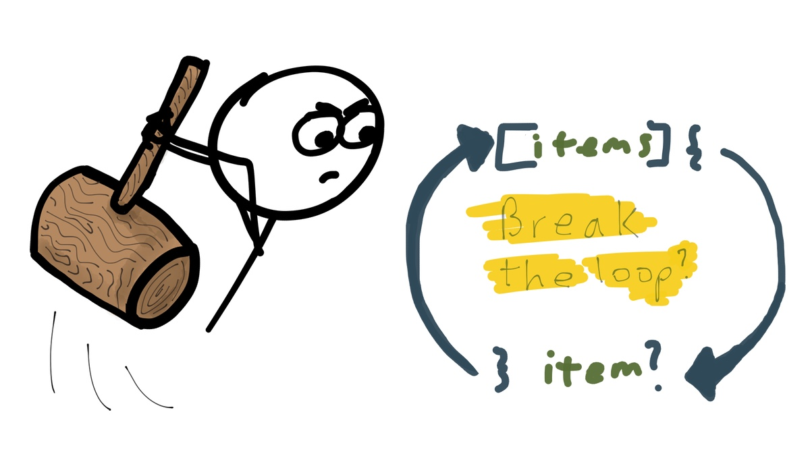
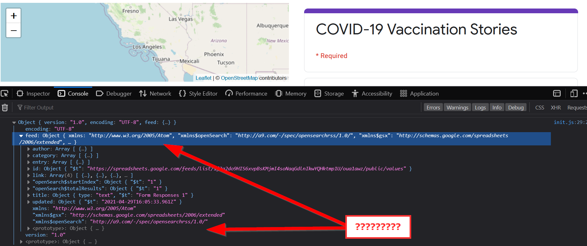
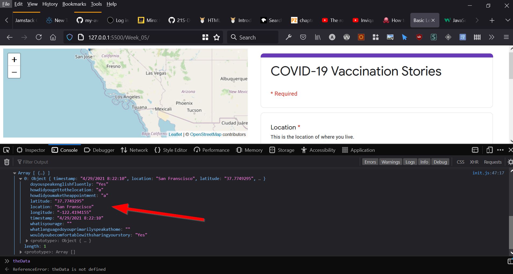

# Loops and APIs

>### Objectives:
> - Implement a trigger for geocoding "location" data in Google Sheets
> - Be able to use loops and conditional statements in JavaScript 
> - Understand what an API is 
> - Add data from a Google Sheet into a website

Start by creating a `week5` folder in your lab assignments repo.

> ### Optional: If you finished `lab 4`, you can also copy the contents of your `week_4` folder and skip the following setup section.

## Setup

Create a new html page called `index.html` and add this code:
> index.html
```html
<!DOCTYPE html>
<html>
    <head>
        <title>Basic Leaflet Map</title>
        <meta charset="utf-8" />
        <link rel="shortcut icon" href="#">
        <link rel="stylesheet" href="styles/style.css">

        <!-- Leaflet's css-->
        <link rel="stylesheet" href="https://unpkg.com/leaflet@1.7.1/dist/leaflet.css" />

        <!-- Leaflet's JavaScript-->
        <script src="https://unpkg.com/leaflet@1.7.1/dist/leaflet.js"></script>
    </head>
    
    <body>
        <div id="mapArea"></div>
        <div id="survey">
        <!-- this is the iframe for our survey -->
            <iframe src="https://docs.google.com/forms/d/e/1FAIpQLSdqVT10bEbUrULMu6Etwj4ZBXGf-LAxcKohAINFbIdZmHS6OA/viewform?embedded=true" width="640" height="654" frameborder="0" marginheight="0" marginwidth="0">Loading…</iframe>
        </div>
        <script src="js/init.js"></script>
    </body>
</html>
```

Create a `styles` folder and create this `style.css`:
>styles/style.css
```css
    body{
        display:grid;
        grid-template-columns: 1fr 1fr; /* this creates an even two column layout*/
        grid-template-areas: "mappanel sidepanel" /* this creates one row with map panel on the left and sidepanel on the right */
    }

    #mapArea{
        height:90vh;
        grid-area: mappanel;
    } 

    #survey{
        grid-area: sidepanel;
    } 
```
Create a `js` folder and create this `init.js`:
>js/init.js
```js
const myMap = L.map('mapArea').setView([34.0709, -118.444], 5);

L.tileLayer('https://{s}.tile.openstreetmap.org/{z}/{x}/{y}.png', {
    attribution: '&copy; <a href="https://www.openstreetmap.org/copyright">OpenStreetMap</a> contributors'
}).addTo(myMap);

let url = "GIVE_ME_A_URL"
fetch(url)
	.then(response => {
		return response.json();
		})
    .then(data =>{
        console.log(data)
    })

function addMarker(lat,lng,message){
        L.marker([lat,lng]).addTo(myMap).bindPopup(`<h2>${message}</h2>`)
        return message    
}

addMarker(37,-122,'home land!')
```
## Revisiting Functions
Open up your Google Sheet from last week. 

Go to column for `Location` and remember what column it is, for me it is `C`:


Next, add two columns, one for `lat` and another for `long`:

Now click on `Tools` -> `Script Editor`:

When you first launch, you will see a blank `myFunction()` get ready to paste over it:

Copy and paste the following code into the entire script:
```js
function myFunction() {
  let sheet = SpreadsheetApp.getActiveSheet();
   
  let range = sheet.getDataRange();
  let cells = range.getValues();
   
  let latitudes = [['lat']];
  let longitudes = [['long']];
   
  for (let i = 0; i < cells.length; i++) {
    // change cells[i][2] if your address is not in column 'C', for example cells[i][1] for column 'B' or cells[i][3] for column D
     addressColumn = cells[i][2] 
     let lat = lng = 0;
    if (i > 0) {
      if (addressColumn){
    let address = addressColumn;
    console.log(address)
 
    if(address){
      let geocoder = Maps.newGeocoder().geocode(address);
      let res = geocoder.results[0];
        if (res) {
          lat = res.geometry.location.lat;
          lng = res.geometry.location.lng;
        }
      }
    }
       latitudes.push([lat]);
    longitudes.push([lng]);
      }
  }
  sheet.getRange('D1') // this is the latitude column
  .offset(0, 0, latitudes.length)
  .setValues(latitudes);
  sheet.getRange('E1') // this is the longitude column
  .offset(0, 0, longitudes.length)
  .setValues(longitudes);
  Utilities.sleep(5000)
}
```
Click on the "run" button to test the script:

If it ran successfully then you should now see latitude and longitude filled in the Google Sheet!


Go back to the Google Scripts and click on triggers:

Click on Add Trigger:


Click on Select Event Type:


Change to `On Form Submit` so that everytime the the form gets submitted a new record gets latitude/longitude added:


Click `Save`:


A pop-up should appear, but if you have a pop-up blocker like on FireFox, then you may have to click on `Options`:


Then allow this particular popup to appear.


Select your Google Account to continue:


Click on `Advanced`:


Click on `Go to Untitled Project (unsafe)`


Click on `Allow`


Click on `Save`:


Congratulations, now each time a form gets submitted you will be able to map the locations:


### Class Exercise #1 - Test your form!
- Add 2-3 locations to your Google Form and see if the new locations work. 
- What type of locations do not show up?
<details>

<summary><b>Answer</b></summary>
Locations that do not show up are when the `location` field is blank or they are not recognized by the Google Geocoder.
</details>

## Publishing your survey
Now that our data is able to be geocoded, we can bring it into our HTML file through JavaScript. But first we have to publish the spreadsheet:

Go to file:


Click on `Publish to web`:


Click on `Publish`:


Copy the URL in the address bar:


### Go to this website:
[https://sandbox.idre.ucla.edu/tools/gsJson/](https://sandbox.idre.ucla.edu/tools/gsJson/)

Paste the URL in:


Click the button, `Get Spreadsheets`:


Click the button, `Get Spreadsheets JSON`:


Copy the results:


In the `init.js` file paste the entire result into the `URL` variable:

> js/init.js
```js
let url = "https://spreadsheets.google.com/feeds/list/1j3a2do9HIS6xvpBsKMjmI4soNaqGdlnIkwYQHktmp1U/oua1awz/public/values?alt=json"
fetch(url)
	.then(response => {
		return response.json();
		})
    .then(data =>{
        console.log(data)
    }
```
In your console, you should now see the Google Spreadsheet data when some one enters information!

## Time for-loops, but they look.. foreign...
In the function that we copy and pasted you may have seen:

```js
  for (let i = 0; i < cells.length; i++) {
    // change cells[i][2] if your address is not in column 'C', for example cells[i][1] for column 'B' or cells[i][3] for column D
     addressColumn = cells[i][2] 
     let lat = lng = 0;
    if (i > 0) {
      if (addressColumn){
    let address = addressColumn;
    console.log(address)
```
> - `for` is a keyword for starting the `for loop`
> - `(let i = 0;` is a placeholder variable for counting, `i` can be anything, but it has be consistent in the `for loop`.
> - `i < cells.length` basically says, "run this loop as long as it is less than the total number of cells."
> - `i++` means keep adding while the loop is able to run
> - `{}` and finally the brackets are the code block to execute while the loop runs.

This is the basic example of a `for` loop. What a `for-loop` means is to `go through the items and do something each time`. Loops are one of the most critical tool for programmers for automating tasks.

When the loop ends, we say that the loop is broken out of:


### Iterable Items
Loops can ONLY occur over iterable items, meaning stuff that you can count or go through, such as numbers, lists, objects, and arrays. 

In the technical schematic diagram above, notice that the items is a [JavaScript array](https://developer.mozilla.org/en-US/docs/Web/JavaScript/Reference/Global_Objects/Array). When the array hits the last item, the loop stops. 

### For of
The [for of](https://developer.mozilla.org/en-US/docs/Web/JavaScript/Reference/Statements/for...of) loop is much easier to understand than the basic `for` loops and works as follows:
```js
const longString = 'hellooooooooooooo'
const array1 = ['a', 'b', 'c'];

// this loops through an array
for (const stuff of array1){
    console.log(stuff)
}

// this loops through a string!
for (const letter in longstring){
    console.log(letter)
}
```
You can use any variable in place of `letter` or `stuff` and it is quite clear what is being looped over inside the scope brackets.

### For Each
When dealing with arrays, such as this:
```js
let myArray = ['hello','this','is','an','array']
```
You can use the `.forEach` method, which is much easier to understand, but acts similar to a `forLoop` and requires a `function` to run:

```js
let myArray = ['hello','this','is','an','array']
myArray.forEach(justChecking);

function justChecking(data){
    console.log(data)
}
```

### Class Exercise #2 - Test your loop!
- Create an [array](https://developer.mozilla.org/en-US/docs/Web/JavaScript/Reference/Global_Objects/Array) of objects 3 or more items
- Loop through an object with some type of [`for`](https://www.w3schools.com/js/js_loop_for.asp) loop
- Loop through an array of objects with [.forEach](https://developer.mozilla.org/en-US/docs/Web/JavaScript/Reference/Global_Objects/Array/forEach)
- Utilize the `array` with `.forEach` in a [function](https://developer.mozilla.org/en-US/docs/Web/JavaScript/Reference/Global_Objects/Function/Function) 

#### Bonus Exercise
- Use the `create marker` function to add your array to the map
- Try to create your own for-loop for counting up to the number 10. [Hint from MDN](https://developer.mozilla.org/en-US/docs/Web/JavaScript/Reference/Statements/for)
<details>

<summary><b>Answer</b></summary>

```js
let myArray = [{'name':'hello','lat':37,'lng':-122},{'name':'this','lat':35,'lng':-119},{'name':'is','lat':36,'lng':-120}]
myArray.forEach(addMarker);

function addMarker(data){
        console.log(data)
        L.marker([data.lat,data.lng]).addTo(map).bindPopup(`<h2>${data.message}</h2>`)
        return data.message    

// Bonus Answer
// let str = '';
// for (let i = 0; i < 11; i++) {
//   str = str + i;
// }

// console.log(str);
// expected output: "012345678"

```

</details>

## Connecting to an API
An [API](https://developer.mozilla.org/en-US/docs/Learn/JavaScript/Client-side_web_APIs/Introduction) can be really thought of as an appliance or application and we are just plugging into it so we can access the data it provides.

Let's see what this means with our data that we just brought in from the Google Sheets:

> js/init.js
```js
let url = "https://spreadsheets.google.com/feeds/list/1j3a2do9HIS6xvpBsKMjmI4soNaqGdlnIkwYQHktmp1U/oua1awz/public/values?alt=json"

fetch(url)
	.then(response => {
		return response.json();
		})
    .then(data =>{
        console.log(data)
    }

```
Notice that the data we got is kind of messy because of the Google API doesn't officially support our methods.



 Let's modify our [arrow function](https://developer.mozilla.org/en-US/docs/Web/JavaScript/Reference/Functions/Arrow_functions) so that we take the data and clean it up. First we will add the `processData` function:

> js/init.js
```js
function processData(theData){
        const formattedData = [] /* this array will eventually be populated with the contents of the spreadsheet's rows */
        const rows = theData.feed.entry // this is the weird Google Sheet API format we will be removing
        // we start a for..of.. loop here 
        for(const row of rows) { 
          const formattedRow = {}
          for(const key in row) {
            // time to get rid of the weird gsx$ format...
            if(key.startsWith("gsx$")) {
                  formattedRow[key.replace("gsx$", "")] = row[key].$t
            }
          }
          // add the clean data
          formattedData.push(formattedRow)
        }
        // lets see what the data looks like when its clean!
        console.log(formattedData)
        // we can actually add functions here too
}
```
Now, let's add the function to clean the data up after our data gets returned:

```js
let url = "https://spreadsheets.google.com/feeds/list/1j3a2do9HIS6xvpBsKMjmI4soNaqGdlnIkwYQHktmp1U/oua1awz/public/values?alt=json"

fetch(url)
	.then(response => {
		return response.json();
		})
    .then(data =>{
        // console.log(data)
        processData(data)
    }

```
Open the debug console and click on our array:


Our data should look nice and clean now! 



Time for the final step..

### Turning our data into markers
Now that our data is cleaned we can use a `.forEach` to `loop` through our data and run the `addMarker()()` function on them. We will add this in our `processData` function.

> js/init.js
```js
function processData(theData){
        const formattedData = [] /* this array will eventually be populated with the contents of the spreadsheet's rows */
        const rows = theData.feed.entry // this is the weird Google Sheet API format we will be removing
        // we start a for..of.. loop here 
        for(const row of rows) { 
          const formattedRow = {}
          for(const key in row) {
            // time to get rid of the weird gsx$ format...
            if(key.startsWith("gsx$")) {
                  formattedRow[key.replace("gsx$", "")] = row[key].$t
            }
          }
          // add the clean data
          formattedData.push(formattedRow)
        }
        // lets see what the data looks like when its clean!
        console.log(formattedData)
        // we can actually add functions here too
        formattedData.forEach(addMarker)
}
```
Open the console and look at our data, we should take note of our field names and the be sure to add them to our markers. Also notice that our markers haven't showed up yet!  That's because we have to modify the `addMarker()` function to use the `data` object:

```js
// old code
// function addMarker(){
//         L.marker([lat,lng]).addTo(map).bindPopup(`<h2>${name}</h2>`)
//         return name    
// }

function addMarker(data){
        // console.log(data)
        // these are the names of our fields in the google sheets:
        L.marker([data.latitude,data.longitude]).addTo(map).bindPopup(`<h2>${data.timestamp}</h2>`)
        return data.timestamp
}
```
Final Code:

> js/init.js
```js
const myMap = L.map('mapArea').setView([34.0709, -118.444], 5);

L.tileLayer('https://{s}.tile.openstreetmap.org/{z}/{x}/{y}.png', {
    attribution: '&copy; <a href="https://www.openstreetmap.org/copyright">OpenStreetMap</a> contributors'
}).addTo(myMap);

function addMarker(data){
        // console.log(data)
        // these are the names of our fields in the google sheets:
        L.marker([data.latitude,data.longitude]).addTo(myMap).bindPopup(`<h2>${data.timestamp}</h2>`)
        return data.timestamp
}

let url = "https://spreadsheets.google.com/feeds/list/1j3a2do9HIS6xvpBsKMjmI4soNaqGdlnIkwYQHktmp1U/oua1awz/public/values?alt=json"

fetch(url)
	.then(response => {
		return response.json();
		})
    .then(data =>{
                // console.log(data)
                formatData(data)
        }
)


function formatData(theData){
        const formattedData = [] /* this array will eventually be populated with the contents of the spreadsheet's rows */
        const rows = theData.feed.entry
        for(const row of rows) {
          const formattedRow = {}
          for(const key in row) {
            if(key.startsWith("gsx$")) {
                  formattedRow[key.replace("gsx$", "")] = row[key].$t
            }
          }
          formattedData.push(formattedRow)
        }
        console.log(formattedData)
        formattedData.forEach(addMarker)        
}
```

> index.html
``` html
<!DOCTYPE html>
<html>
    <head>
        <title>Basic Leaflet Map</title>
        <meta charset="utf-8" />
        <link rel="shortcut icon" href="#">
        <link rel="stylesheet" href="style/style.css">

        <!-- Leaflet's css-->
        <link rel="stylesheet" href="https://unpkg.com/leaflet@1.7.1/dist/leaflet.css" />

        <!-- Leaflet's JavaScript-->
        <script src="https://unpkg.com/leaflet@1.7.1/dist/leaflet.js"></script>
    </head>
    
    <body>
        <div id="mapArea"></div>
        <div id="survey">
        <!-- this is the iframe for our survey -->
            <iframe src="https://docs.google.com/forms/d/e/1FAIpQLSdqVT10bEbUrULMu6Etwj4ZBXGf-LAxcKohAINFbIdZmHS6OA/viewform?embedded=true" width="640" height="654" frameborder="0" marginheight="0" marginwidth="0">Loading…</iframe>
        </div>
        <script src="js/init.js"></script>
    </body>
</html>
```

>style/style.css
```css
body{
    display:grid;
    grid-template-columns: 1fr 1fr; /* this creates an even two column layout*/
    grid-template-areas: "mappanel sidepanel" /* this creates one row with map panel on the left and sidepanel on the right */
}

#mapArea{
    height:90vh;
    grid-area: mappanel;
} 

#survey{
    grid-area: sidepanel;
} 
```
Congratulations on finishing the lab! You only need to add a few data fields in order to finish the lab assignment.

## Lab Assignment #4 - Loops and APIs
### Due 7/21

In this week's lab, we learned how to loop through data and connect to an API. Your task is to create a mini-version of the final group project for the class that intakes data and maps it.

The requirements are:

- Use any type of [for-loop](https://www.w3schools.com/js/js_loop_for.asp) within a [JavaScript function](https://developer.mozilla.org/en-US/docs/Web/JavaScript/Reference/Global_Objects/Function/Function) that adds API data from a Google Spreadsheet form.
- Add a pop-up with at least 2 fields from the Google Form.
- Add data from Google Spreadsheets into your map

## Submission
- Commit your changes to GitHub
- Find your `index.html` in the `Week_04` folder and copy the URL. It should look something like this:
  - https://albertkun.github.io/211A-ASIAAM-191A-Assignments/Week_04/index.html
- Paste your link as a comment in the Discussion forum for Lab Assignment #4: 
  - https://github.com/albertkun/211A-ASIAAM-191A/discussions/137

